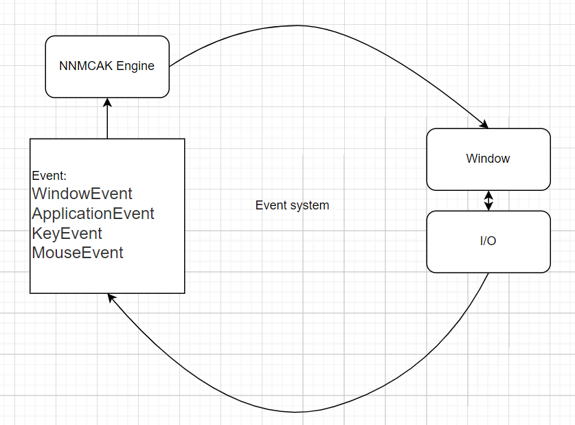

# Nanamichiaki
This is the learning game engine project Nanamichiaki Engine based on TheCherno's game engine project Hazel. YouTube channel: https://www.youtube.com/@TheCherno

## Learn  
### 入口点的添加 [24/8/9]  
* 创建了NNMCAK-dll、Sandbox-exe  
* 在NNMCAK中引用main函数，调用NNMCAK声明的CreateApplication，调用其中不可重写的Run方法，让引擎保持持续运行，通过在app中继承Application类，并且定义CreateApplication方法，达到入口点main在dll中的目的  

### [24/8/10]  
* 引入了第三方库spdlog作为引擎日志库的依赖  
* 引擎模块增加了LOG模块，区分引擎内部Core和外部引用应用App作为两份日志的输出  
* 首先使用NNMCAK::Log::Init() 初始化日志，使用类似NNMCAK_CORE_ERROR作为日志输出。日志等级：trace、info、warn、error、fatal  
* 引入了构建系统premake5，方便构建整个系统，复制dll文件等操作。只需要运行项目目录下的GenerateProjects.bat即可在windows下完成构建！  

### [24/8/11]  
* 事件系统设计思路：  
  

* 当前设计事件系统支持如下：  
	1. 窗口事件：WindowClose、WindowResize  
	2. 应用系统事件：AppTick、AppUpdate、 AppRender  
	3. 按键事件：KeyPressed、KeyReleased  
	4. 鼠标事件：MouseButtonPressed、 MouseButtonReleased、MouseMoved、MouseScrolled  

* 事件系统基类为Event、事件系统调度为EventDispatcher进行调度  
* 事件系统均支持打印，或者日志输出。输出对象为ToString方法  
* 增加NNMCAKpch.h 预编译头，将标准库的头文件放入，方便后续的快速build。目前只有动态库能够生成  